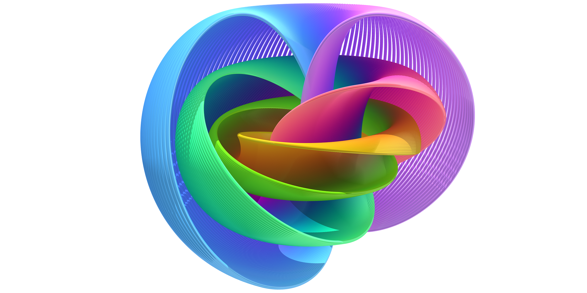

<!--  -->

                                       _____ __            __  _
                                      / __(_) /  _______ _/ /_(_)__  ___
                                     / _// / _ \/ __/ _ `/ __/ / _ \/ _ \
                                    /_/ /_/_.__/_/  \_,_/\__/_/\___/_//_/
                                            FOSS Modular Synth Framework

Open source modular synthesizer embedded software framework [WIP]

# Feature

-   written in C++
-   based on STM32 (F303xx atm)
-   based on FreeRTOS and interfaced over [ccp_freertos](https://github.com/michaelbecker/freertos-addons) wrapper
-   DMA/I2S driven audio streamer for easy external ADC/DAC interfacing
-   hardware FPU enabled CMSIS DSP support
-   thread-safe and DSP oriented peripheral hardware resource manager (In progress)
-   Common synth component high-level implementations (pot, slider, button, led, rotary encoder... TBD)
-   lightweight command shell and logger over UART (nice for experimenting and debugging)
-   _Tracealyzer_ support (TBD)

# Framework

        +------------+     +-----------+     +------------+     +-------------+     +-----------+
        | Modular    |     | Module #1 |     | Module # 2 |     | Module #... |     | Module #N |
        | Synth      |     +----+------+     +-----+------+     +------+------+     +-----+-----+
        | apps       |          |                  |                   |                  |
        | (hardware) |          +------------------+---------+---------+------------------+
        |            |                                       |
        +------------+  +------------+-----------+-----------+------------+------------+-----------+
        | component  |  |  Audio In  | Audio Out |   CV In   |   CV Out   |  Gate In   | Gate Out  |
        | drivers    |  +------------+-----------+-----------+------------+------------+-----------+
        |            |  |  Clock In  |Clock Out  |  Button   |    Knob    |   Slider   |    LED    |
        |            |  +------------+-----------+-----------+------------+------------+-----------+
        |            |  |  Display   |  microSD  |    Mic    |    and     |    more    |    ...    |
        +------------+  +------------+----+------+-----------+------------+------+-----+-----------+
        | services,  |  |   Shell/Logger  |   AudioStream    |    CMSIS DSP      |     Variable    |
        | streams    |  |                 |                  |    Q-aritmetic    |                 |
        +------------+  +-----------------+------------------+-------------------+-----------------+
        | core,      |  |         Resources Manager          |     third-party libs (FAT32, etc.)  |
        | peripheral |  +------------------------------------+-------------------------------------+
        | hardware,  |  |               FreeRTOS / ccp_freertos / SYSTEMVIEW(opt.)                 |
        | interface  |  +-----------------+------------------+-------------------+-----------------+
        |            |  |    DMA / UART   |    DMA / I2S     |       HW FPU      |    ADC / GPIO   |
        +------------+  +-----------------+------------------+-------------------+-----------------+
        |            |  |                                STM32 HAL                                 |
        |  BSP/MSP   |  +--------------------------------------------------------------------------+
        |  hardware  |  |                               STM32F303XX                                |
        +------------+  +--------------------------------------------------------------------------+

# Modules

> Particle physics themed modular system ...heh

        +=========+=================================+    +=========================================+
        | Name    | Feature Set                     |    |           The Standard Model            |
        +=========+=================================+    +=========================================+
        | Higgs   |                ?                |    |           | Scalar  | Higgs Boson       |
        +---------+---------------------------------+    |           +---------+-------------------+
        | Photon  |                ?                |    |           |         | Photon            |
        +---------+---------------------------------+    |           |         +-------------------+
        | Gluon   |                ?                |    |  Bosons   |         | Gluon             |
        +---------+---------------------------------+    |           |  Gauge  +-------------------+
        | Wiggs   |                ?                |    |           |         | W Boson           |
        +---------+---------------------------------+    |           |         +-------------------+
        | Ziggs   |                ?                |    |           |         | Z Boson           |
        +---------+---------------------------------+    +-----------+---------+-------------------+
        | Quarp   |                ?                |    |           |         | Up                |
        +---------+---------------------------------+    |           |         +-------------------+
        | Charm   |                ?                |    |           |         | Charm             |
        +---------+---------------------------------+    |           | Quarks  +-------------------+
        | Fermit  |                ?                |    |           |         | Top               |
        +---------+---------------------------------+    |           |         +-------------------+
        | Dark    |                ?                |    |           |         | Down              |
        +---------+---------------------------------+    |           |         +-------------------+
        | Strange |                ?                |    |           |         | Strange           |
        +---------+---------------------------------+    |           +---------+-------------------+
        | Leptron |                ?                |    | Fermions  |         | Lepton            |
        +---------+---------------------------------+    |           |         +-------------------+
        | Muon    |                ?                |    |           |         | Muon              |
        +---------+---------------------------------+    |           |         +-------------------+
        | Tau     |                ?                |    |           |         | Tau               |
        +---------+---------------------------------+    |           | Leptons +-------------------+
        | Leptro  |                ?                |    |           |         | Tau Neutrino      |
        +---------+---------------------------------+    |           |         +-------------------+
        | Mutro   |                ?                |    |           |         | Muon Neutrino     |
        +---------+---------------------------------+    |           |         +-------------------+
        | Etro    |                ?                |    |           |         | Electron Neutrino |
        +---------+---------------------------------+    +-----------+---------+-------------------+

# Status

Experimentation phase, no releases yet.

# Licenses

-   GNU GPL-3.0 for software
-   CERN OHL-2.0 for hardware

# Development Enviroment

It started and mostly continued on Raspberry Pi4 (Raspbian OS (debian)) remotely using VSCode "Remote - WSL" extension
(ms-vscode-remote.remote-wsl) from Windows PC. Yes, that is a pretty weird setup.

I managed to setup building/flashing/debugging experience on VSCode on Windows using Ubuntu WSL (Ubuntu enviroment on
Windows, just google how to install WSL). The setup is almost identical for both Linux and WSL cases.

0. Install WSL if using windows. I recommend installing WSL version 2.

1. Install common apt package prerequisites:

```shell
sudo apt install git make cmake clang-format
```

2. Here's where setup differs for native Linux and WSL.
   - For WSL follow `USB utilities on WSL` clause below and move on to the step 3.
   - For native Linux simply install USB tools using the following `sudo apt install stlink-tools openocd`

3. Install GNU Arm Embedded Toolchain (`arm-none-eabi-*`) - see clause below.

4. Install [Visual Studio Code](https://code.visualstudio.com/) and `ms-vscode-remote.remote-wsl` extension if using WSL.

5. In WSL or native linux terminal navigate to where you want to install fibration project and do:

```shell
git clone https://github.com/lukasnee/fibration.git
cd fibration
git submodule update --recurse --init
git checkout -b my-branch
code .
```

> A VSCode windows should start loading. In WSL case, make sure VSCode starts in WSL mode (in the bottom left corner you should see a colored box with text: `[WSL: Ubuntu]`

6. Install following VSCode extensions:

-   `ms-vscode.cpptools`
-   `twxs.cmake`
-   `marus25.cortex-debug`
-   `xaver.clang-format`

> make sure they are installed on WSL service thing

8. Build project `higgs` by running VSCode tasks `build higgs [release]` or run manually using `./utils/build.sh -p higgs -t release`.

> **NOTE**: Initial build can fail so try building a couple times more.

9. Flash project `higgs` by running VSCode tasks `build and flash higgs [release]` or run manually using `./utils/flash.sh -p higgs -t release -b`.

10. That's it!

## GNU Arm Embedded Toolchain

It is tempting to simply install GNU Arm Embedded Toolchain with oneliner like this:

```shell
sudo apt install gcc-arm-none-eabi
```

But this distribution always caused me problems - outdated and missing `arm-none-eabi-gdb`. Therefore I recommend
installing it manually. Here's how
[based on a very nice forum answer by Aleksander Khoroshko](https://askubuntu.com/questions/1243252/how-to-install-arm-none-eabi-gdb-on-ubuntu-20-04-lts-focal-fossa):

1. Make sure you don't have the GNU Arm Embedded Toolchain apt package on you system:

```shell
sudo apt remove gcc-arm-none-eabi
```

2. Download the latest version (Linux x86_64 Tarball)
   [from official website](https://developer.arm.com/tools-and-software/open-source-software/developer-tools/gnu-toolchain/gnu-rm/downloads).
   Unpack it into any directory, for example:

```shell
sudo tar xjf gcc-arm-none-eabi-<VERSION>.bz2 -C /usr/share/
```

3. Create symbolic links so that binaries are accessible system-wide:

```shell
sudo ln -s /usr/share/gcc-arm-none-eabi-<VERSION>/bin/arm-none-eabi-gcc /usr/bin/arm-none-eabi-gcc
sudo ln -s /usr/share/gcc-arm-none-eabi-<VERSION>/bin/arm-none-eabi-g++ /usr/bin/arm-none-eabi-g++
sudo ln -s /usr/share/gcc-arm-none-eabi-<VERSION>/bin/arm-none-eabi-gdb /usr/bin/arm-none-eabi-gdb
sudo ln -s /usr/share/gcc-arm-none-eabi-<VERSION>/bin/arm-none-eabi-size /usr/bin/arm-none-eabi-size
sudo ln -s /usr/share/gcc-arm-none-eabi-<VERSION>/bin/arm-none-eabi-objcopy /usr/bin/arm-none-eabi-objcopy
sudo ln -s /usr/share/gcc-arm-none-eabi-<VERSION>/bin/arm-none-eabi-objdump /usr/bin/arm-none-eabi-objdump
sudo ln -s /usr/share/gcc-arm-none-eabi-<VERSION>/bin/arm-none-eabi-nm /usr/bin/arm-none-eabi-nm
# ... link other arm-none-eabi-* if you intend to use
```

4. Install and link dependencies (gdb uses ncurses):

```shell
sudo apt install libncurses-dev
sudo ln -s -f /usr/lib/x86_64-linux-gnu/libncurses.so.6 /usr/lib/x86_64-linux-gnu/libncurses.so.5
sudo ln -s -f /usr/lib/x86_64-linux-gnu/libtinfo.so.6 /usr/lib/x86_64-linux-gnu/libtinfo.so.5
```

5. That is it ! Check if tools are working using:

```shell
arm-none-eabi-gcc --version
arm-none-eabi-g++ --version
arm-none-eabi-gdb --version
arm-none-eabi-size --version
arm-none-eabi-objcopy --version
arm-none-eabi-objdump --version
arm-none-eabi-nm --version
```

## OpenOCD on WSL

As far as I know Ubuntu WSL does not support USB so `OpenOCD` apt package based on `libusb` won't
work.

Luckily:

-   both applications are available on Windows (based on Win USB drivers).
-   WSL has your Windows drive disk(s) mounted by default. For example, `C:/` -> `/mnt/c/`.
-   WSL can run `win32` executables seamlessly.

Thus you can download and install `win32` binaries of interest and create symbolic links in `/usr/bin/` directory for
them to be accessed system-wide. Here's what to do in detail:

1. Make sure you don't have `openocd` apt packages installed on your WSL system:

```shell
sudo apt remove openocd
```

2. [OpenOCD](https://github.com/xpack-dev-tools/openocd-xpack/releases) (`xpack-openocd-<VERSION>-win32-x64.zip`)
   distributions for windows.
3. Install (unzip) into any directory, for example `C:/User/<USER>/bin/`.
4. Symbolically link executables. Example:

```shell
sudo ln -s /mnt/c/Users/lukas/bin/xpack-openocd-0.11.0-2/bin/openocd.exe /usr/bin/openocd
```

Now you should be able to use `openocd` executable from WSL bash. Test by connecting ST-LINK over USB and:

```shell
openocd -f "interface/stlink.cfg" -f "target/stm32f3x.cfg"
```

`openocd` gdb server should not return. You should expect:

```
Info : starting gdb server for stm32f3x.cpu on 3333
Info : Listening on port 3333 for gdb connections
```

## Handy VSCode keybindings

Insert the following in your VSCode's `keybindings.json`. You can search it up using `ctrl+p` and typing
`>Open Keyboard Shortcuts (JSON)`.

> For example: `C:/Users/lukas/AppData/Roaming/Code/User/keybindings.json`

```json
[
    // Fibration workspace
    { "key": "shift+space i", "command": "workbench.action.tasks.runTask", "args": "get st-link and target info" },
    { "key": "shift+space p", "command": "workbench.action.tasks.runTask", "args": "probe for st-link device" },
    { "key": "shift+space f", "command": "workbench.action.tasks.runTask", "args": "build and flash higgs [release]" },
    { "key": "shift+space b", "command": "workbench.action.tasks.runTask", "args": "build higgs [release]" },
    { "key": "shift+space t", "command": "workbench.action.tasks.runTask", "args": "build and run unit tests" }
]
```
